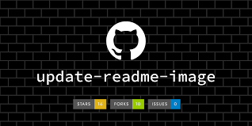

    

<h1 id="descricao" align="center">Padrão README</h1>

Este README tem o objetivo de apresentar uma boa documentação referente a projetos do GITHUB

## Será apresentado:

- Badges
- Menu / Tabela de Conteúdo  
- Tecnologias Utilizadas 

 

 

 

## Tabela de Conteúdo

<!-- <ul>
    <li><a href="#descricao">Descrição Projeto</a></li>
    <li><a href="#tecnologia">Tecnologias</a></li>
</u>
 -->

<a href="#descricao">Descrição Projeto</a> | <a href="#tecnologia">Tecnologias</a>

## Status do Projeto 
<h4>Em construção...</h4>
